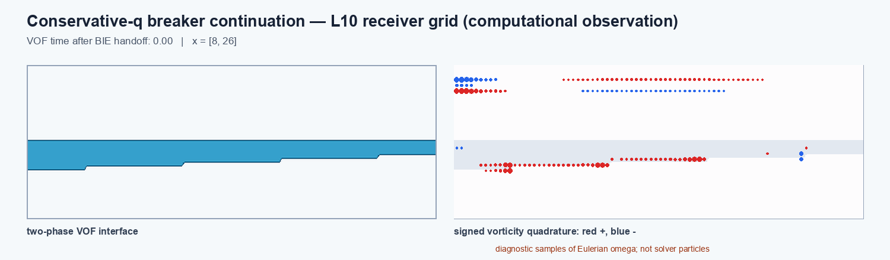

# Conservative transfer of potential-flow states to embedded-boundary VOF

[](https://doi.org/10.5281/zenodo.23104556)

The current study is **Geometry-consistent conservative transfer of potential-flow
states to an embedded-boundary volume-of-fluid solver** by Saveliy Baturin.

- [Read the article (PDF)](manuscript/transfer_article.pdf), or use its
  [LaTeX source](manuscript/transfer_article.tex).
- [Code, numerical experiments and replay instructions](research/releases/transfer_20261001/README.md)
  accompany the transfer study, including the 21 analytic initial-field cases,
  smooth-wave continuations and the two-fluid physical-reference comparison.
- [Release title and description](RELEASE_v0.31.0.txt) and [citation metadata](CITATION.cff)
  describe the v0.31.0 snapshot.

Verify the publication files and numerical archive before analysis:

```sh
python scripts/verify_transfer_publication.py
python research/releases/transfer_20261001/verify_release.py
```

On Windows with an existing MiKTeX installation, build the current article with
`python scripts/build_transfer_pdf.py`. Its output is
`manuscript/transfer_article.pdf`; temporary files go to `build/`.
The document also uses standard pdfLaTeX packages: on another TeX distribution,
run `pdflatex -interaction=nonstopmode -halt-on-error transfer_article.tex`
twice from `manuscript/`.

The archived **v0.31.0** code and numerical experiments are available at
[doi:10.5281/zenodo.23104557](https://doi.org/10.5281/zenodo.23104557).
The badge above links to the series of releases; cite the version DOI for
these experiments. The current manuscript adds the archive citation after
the release; the archived tag and experiment files remain unchanged.

The older `manuscript/main.tex` and root `paper.pdf` describe the earlier
variable-bathymetry study below. They are preserved as historical material
and are not the transfer article linked above.

## Earlier variable-bathymetry study

Research code and evidence package for the manuscript **“Conservative
divergence-conforming state transfer from adaptive potential-flow BIE to
embedded VOF: overturning waves over variable bathymetry.”**

The earlier manuscript is available as [`paper.pdf`](paper.pdf). Its central
result is a one-way transition that preserves the physical liquid measure,
constructs a divergence-conforming MAC field, and constrains receiver-grid
momentum. The resulting VOF continuation is stable on receiver levels 8--10
through nondimensional time 6. The level-10 gas cavity is not reproduced on
levels 8 and 9, so this repository does **not** claim grid-converged impact or
air entrainment.



The animation is a downsampled view of the completed level-10 calculation.
The right-hand markers are signed samples of the resolved Eulerian vorticity,
not Lagrangian solver particles. The apparent gas cavities remain a
resolution-dependent computational observation.

## Repository contents

| Path | Contents |
| --- | --- |
| `paper.pdf` | Compiled manuscript linked from GitHub |
| `manuscript/` | LaTeX source and bibliography |
| `research/` | Euler--BIE, handoff, VOF-analysis, plotting, and test code |
| `research/results/` | Compact machine-readable evidence, ablations, timing-screen provenance, and figures |
| `research/two_phase_basilisk/` | Basilisk receiver, conservative aperture operator, and generated L8--L10 inputs |
| `DATA_AVAILABILITY.md` | Included data, omitted raw frames, and the expected archive layout |

Development caches, LaTeX intermediates, rendered QA pages, executables, and
the historical thesis/notebook tree are intentionally excluded.

## Quick verification

Python 3.11 or newer is recommended.

```bash
python -m venv .venv
# Windows: .venv\Scripts\python -m pip install -r requirements-dev.txt
# Linux/macOS: .venv/bin/python -m pip install -r requirements-dev.txt
python -m pytest -q research
python scripts/check_artifacts.py
```

The packaged state passes 111 tests. The artifact check validates the PDF,
JSON/NPZ evidence, the three receiver levels, the animation, the OpenMP
repeatability screens, and the deliberately negative topology and morphology
decisions.

## Reproduce packaged figures

The close-quadrature experiment is small enough to rerun directly:

```bash
python research/near_self_quadrature_study.py
```

The MAC handoff plot and the two figures backed by packaged derived arrays can
be regenerated without the large raw receiver archives:

```bash
python research/plot_mac_face_handoff_audit.py
python research/replot_publication_figures.py
```

The matched-time VOF comparison and vorticity keyframe require the raw frame
archives described in [`DATA_AVAILABILITY.md`](DATA_AVAILABILITY.md). Their
published PNGs and the scripts used to create them are included.

The compact L10 VOF/vorticity animation can be regenerated from the same raw
sequence while retaining every third output frame:

```bash
python research/render_vorticity_points.py \
  research/two_phase_basilisk/remote_impact_claim/impact_claim_q_l10_t60_final \
  research/results/publication_package/impact_claim_q_l10_vorticity_evolution \
  --dt 0.02 --fps 15 --frame-step 3 --optimize-gif \
  --x-min 8 --x-max 26 --domain-length 32 \
  --level-label "L10 receiver grid (computational observation)"
```

## Build the paper

With a LaTeX distribution providing `latexmk` and BibTeX:

```powershell
powershell -ExecutionPolicy Bypass -File .\scripts\build-paper.ps1
```

or:

```bash
./scripts/build-paper.sh
```

Both commands compile `manuscript/main.tex` and replace the root `paper.pdf`
only after a successful build.

## Full receiver calculation

The three-grid receiver is a Linux/Basilisk calculation. Exact compile flags,
the pinned container digest, the conservative transport headers, and the
generated L8--L10 handoff inputs are documented in
[`research/two_phase_basilisk/README.md`](research/two_phase_basilisk/README.md).
The full runs are computationally expensive; the checked-in diagnostic logs
and derived evidence allow the reported numerical decisions to be audited
without rerunning them.

## CPU parallel repeatability

Short, fixed-end-time OpenMP screens are included under
`research/results/performance/`. On the recorded Ryzen 9 9900X host, four
threads reduced the L10 wall time from 57.95 s to 19.82 s (2.92x) while the
thresholded VOF mask remained identical to the one-thread reference. The final
kinetic energy differed by (2.35\times10^{-5}) relatively because parallel
reductions are not bitwise deterministic. On L9, eight threads were slower
than four. These runs justify the four-thread performance configuration; they
are not spatial-convergence evidence.

## Citation

Use [`CITATION.cff`](CITATION.cff) from GitHub’s “Cite this repository” menu.
The publication revision is tagged `v0.29.0-openmp-visualization`. Update the
citation metadata with the journal DOI and the repository archive DOI when
those identifiers exist.

## License

Original research code is MIT-licensed; the manuscript, figures, and derived
data are CC BY 4.0. See [`LICENSE.md`](LICENSE.md). No third-party raw dataset
is redistributed here.
